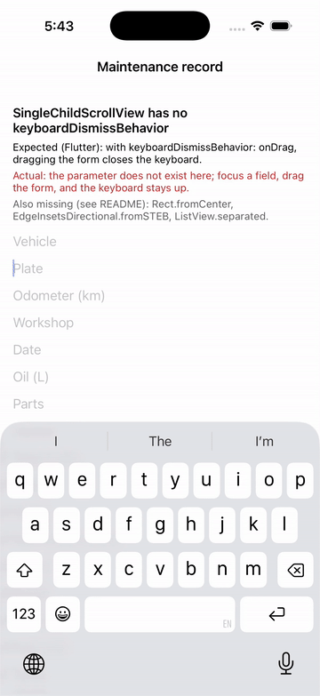

# Repro: four small missing APIs (Rect.fromCenter, EdgeInsetsDirectional.fromSTEB, ListView.separated, SingleChildScrollView.keyboardDismissBehavior)

Four small Flutter APIs that ported code uses and DartNative 1.0.0 doesn't have. Each has a workaround, but each one breaks a straight port. The one you can see on screen is `keyboardDismissBehavior`: `ListView` and `ReorderableListView` have it, `SingleChildScrollView` doesn't, so a long form in a `SingleChildScrollView` can't close the keyboard on drag.

## Run

`dn run` (iOS simulator; Android behaves the same unless stated).

## What you'll see

1. A long form (22 `TextField`s) in a `SingleChildScrollView`.
2. Tap a field: the keyboard comes up.
3. Drag the form up and down: it scrolls and the keyboard stays up.

The recording starts with a field already focused (focus then moves from Plate to Odometer), and is cut from a longer capture with the idle stretches removed.

## Expected

With `keyboardDismissBehavior: ScrollViewKeyboardDismissBehavior.onDrag` (as in Flutter, and as `ListView` already supports here), the drag closes the keyboard. On iOS that is `UIScrollView.keyboardDismissMode = .onDrag`.

## What we'd write in Flutter

```dart
// 1. A rect centred on a point (hit areas, custom painters).
final hit = Rect.fromCenter(center: tap, width: 44, height: 44);

// 2. Directional insets in one call.
const padding = EdgeInsetsDirectional.fromSTEB(16, 8, 12, 8);

// 3. A list with dividers between rows.
ListView.separated(
  itemCount: records.length,
  itemBuilder: (context, i) => RecordTile(records[i]),
  separatorBuilder: (context, i) => const Divider(height: 1),
)

// 4. Close the keyboard when the form is dragged.
SingleChildScrollView(
  keyboardDismissBehavior: ScrollViewKeyboardDismissBehavior.onDrag,
  child: Form(child: Column(children: fields)),
)
```

`dn analyze` on 1.0.0:

```
error • The method 'fromCenter' isn't defined for the type 'Rect' • undefined_method
error • The method 'fromSTEB' isn't defined for the type 'EdgeInsetsDirectional' • undefined_method
error • The method 'separated' isn't defined for the type 'ListView' • undefined_method
error • The named parameter 'keyboardDismissBehavior' isn't defined • undefined_named_parameter
```

## Recording



[recording/ios.mp4](recording/ios.mp4) · [screenshot](recording/ios.png)

## Environment

- DartNative 1.0.0 (SDK `113c27aacb2`, framework edition `7ae29132`), Dart 3.12.0
- macOS 26.7.1, Xcode 26.1.1
- iPhone 17 simulator, iOS 26.1
